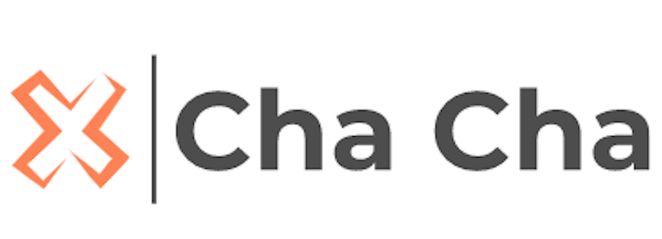
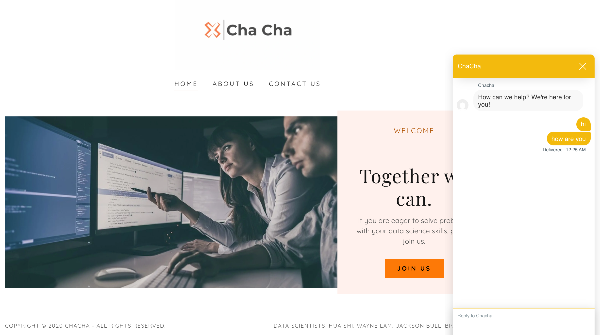
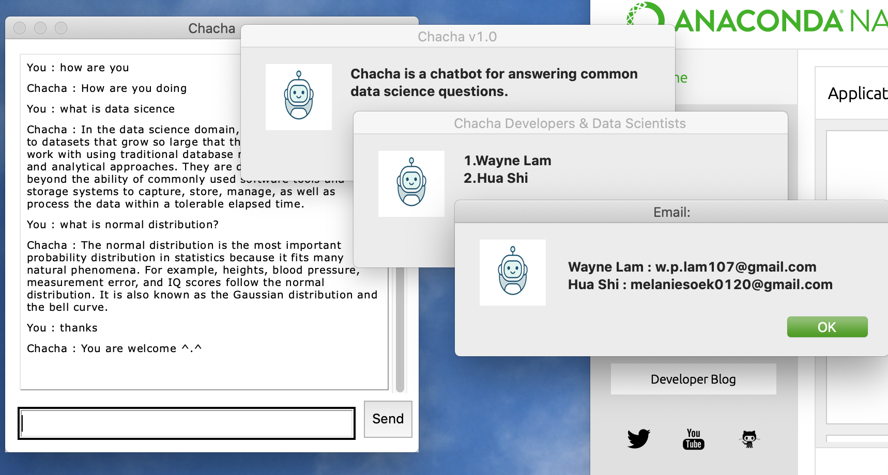
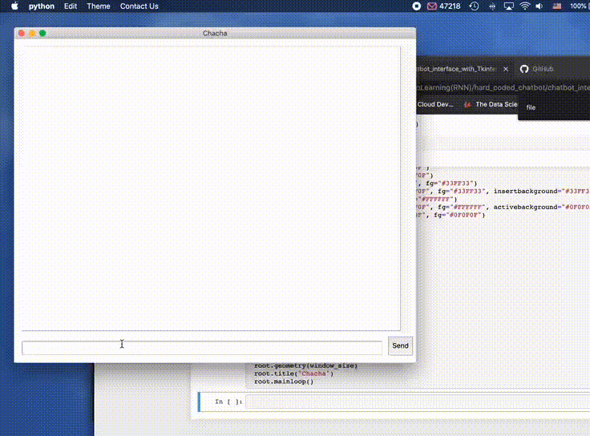
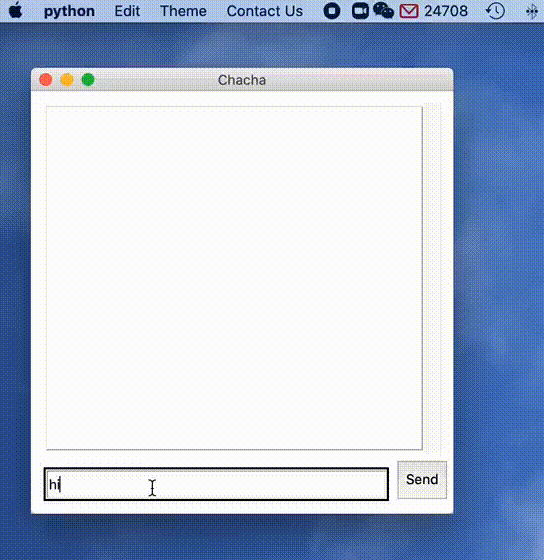

# Chatbot Project

## Team Members

## Introduction
Nowadays, chatbots are very popular in different territories such as sales, e-commerce, health companies, restaurants, retail industry, etc. Because a chatbot significantly shortens the waiting time and it can help and answer different consumers' common questions simultaneously and instantly. Also, it can help companies to reduce the cost to serve people.
## Goal
The goal of this chatbot project is to answer data science students common questions. This project contains two parts - hard-coded part and deep learning part.
The datasets were collected from reddit API and Stack Overflow (Web Scraping). Wayne created a Class which helped us to collect data easily.

 Besides, [Natural Language Processing](https://en.wikipedia.org/wiki/Natural_language_processing) (NLP) was applied in both parts. 
For hard-coded chatbot, after NLP preprocessing, basically I created an algorithm to find which sentences have more keywords, but matching the keywords is not accurate enough, I also want to know what is the ratio of the keywords to the complete sentence in order to increase the accuracy. 

For the deep learning part, we applied a sequence to sequence model with TensorFlow and I realized that our data is very huge, and it will take serval days to complete the task. So we decided to train the model on Cloud Platform GCP(Hua) and AWS(Wayne). 

There are two different interfaces for this chatbot - web version and [tkinter](https://docs.python.org/3/library/tkinter.html) version.
### Web Version

### Tkinter Version (hard-coded VS Deep Learning)

# Hard-coded Chatbot
In this part we collected datasets which are definitions, concepts and fixed usages. NLP part contains tokenization, punctuation removal, stop words removal, stemming and lemmatization.  

# RNN Chatbot
The conversation for chatbot in this part will be more general. 

